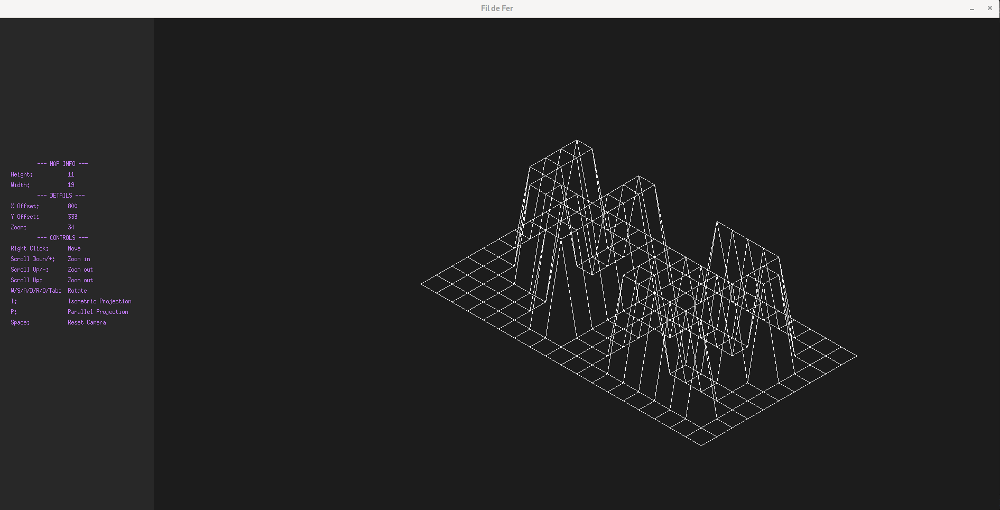
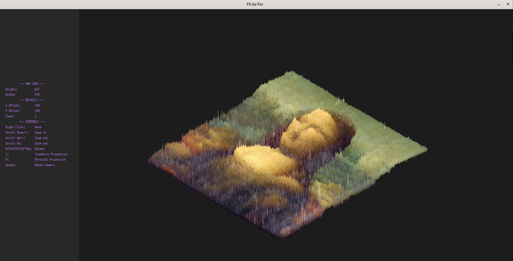
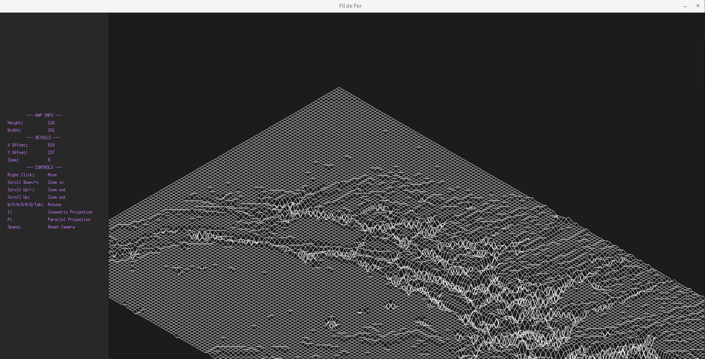

<h1 align="center">
	Fil de Fer
</h1>

<p align="center">
	<b><i> FdF is a project to learn about 3D graphics programming. 
  The program takes a height-width-depth file as input 
  and renders the 3D map into the 2D screen as a wireframe model.
  You can rotate, zoom in/out, and move the model in the window.
  The project uses the minilibx-linux library created by the 42 Network.</i></b><br>
</p>

<p align="center">




</p>

## Installation
1. Clone the repository:
    ```sh
    git clone https://github.com/dafneko/42_FdF.git
    cd 42_FdF
    ```
2. Navigate to the project repository:
    ```sh
    cd 42_FdF
    ```
3. Compile using make:
   ```sh
   make
   ```
## Usage
To run the program, use the following command:
```sh
./fdf map_file
```
Replace map_file with any map file located in the test_maps directory. For example:
./fdf 42.fdf
or
./fdf monalisa_colored.fdf

# Controls

### Keyboard
| Key              | Action                             |
|------------------|------------------------------------|
| `W`              | X axis Rotation                    |
| `S`              | X axis Rotation                    |
| `A`              | Y axis Rotation                    |
| `D`              | Y axis Rotation                    |
| `Q`              | Z axis Rotation                    |
| `E`              | Z axis Rotation                    |
| `+`              | Zoom In                            |
| `-`              | Zoom Out                           |
| `ESC`            | Exit Program                       |

### Mouse
| Button           | Action                             |
|------------------|------------------------------------|
| `Right Click`    | Hold and move around               |
| `Scroll Up`      | Zoom Out                           |
| `Scroll Down`    | Zoom In                            |


